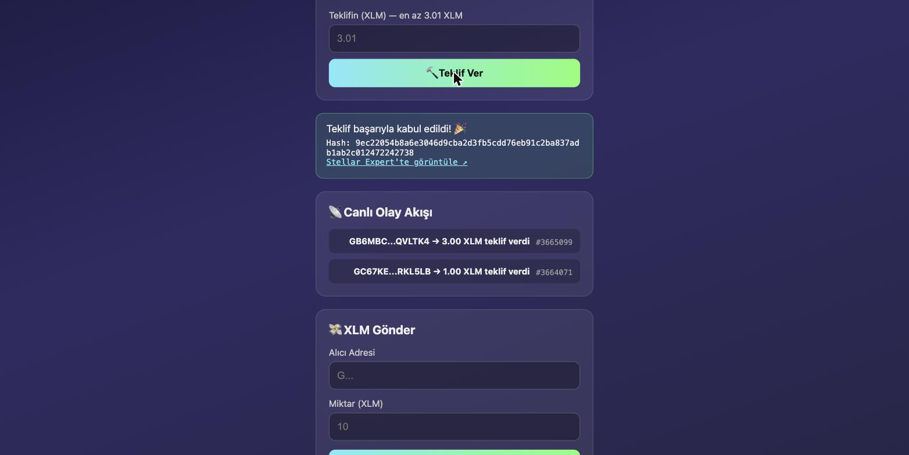
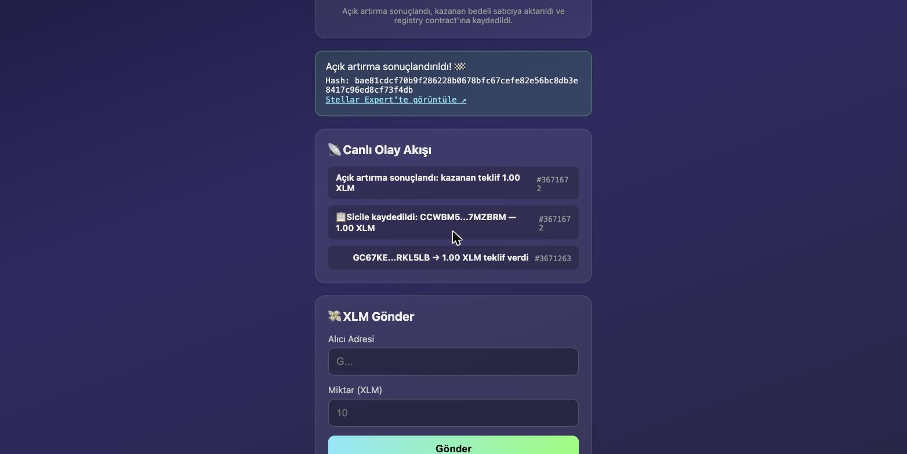
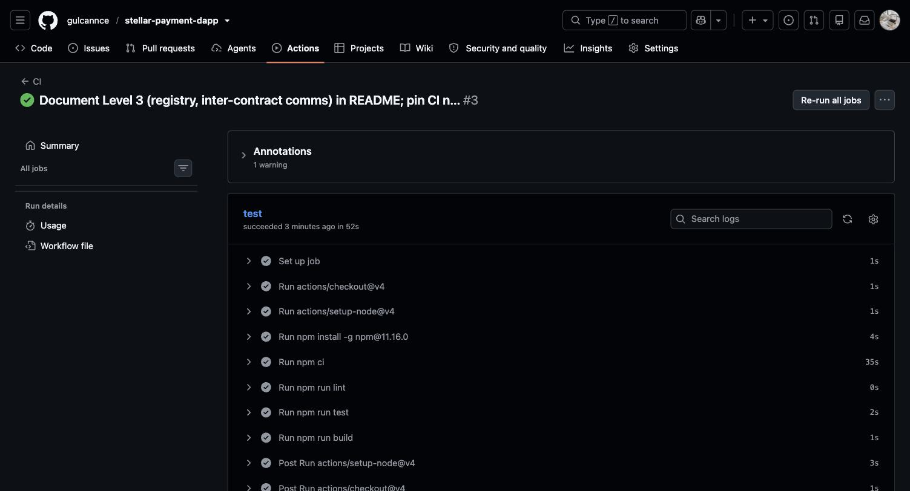
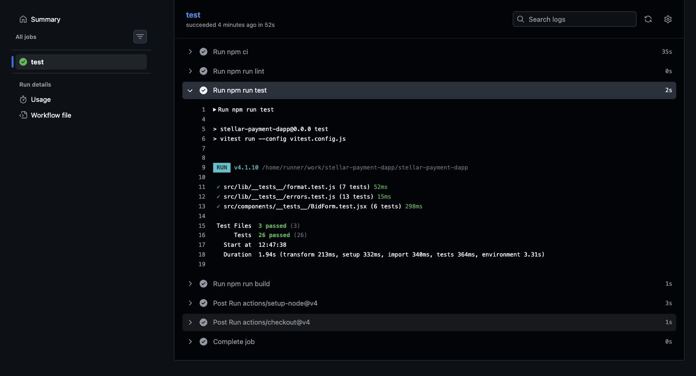
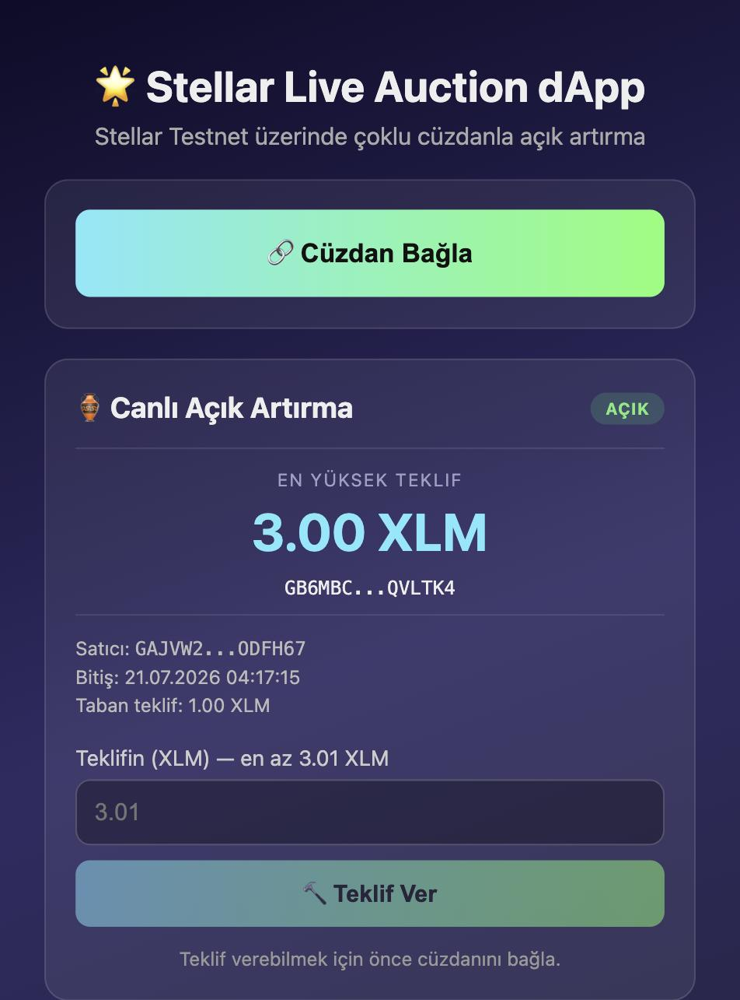

# 🌟 Stellar Live Auction dApp

A Stellar Testnet dApp built for the Rise In "Stellar Journey to Mastery" challenge.

- **Level 1 – White Belt** ✅ *(Approved)* — a payment dApp (Freighter wallet, XLM balance, send XLM, transaction history)
- **Level 2 – Yellow Belt** ✅ *(Approved)* — evolves the same app into a **live, on-chain auction**: multi-wallet support, a deployed Soroban smart contract, real-time event synchronization, and explicit transaction-status tracking.
- **Level 3 – Orange Belt** *(Pending Review)* — adds a second Soroban contract with **inter-contract communication** (the auction reports each finalized sale to a platform-wide registry), a CI/CD pipeline, and a full test suite across both contracts and the frontend.
- **Level 4 – Green Belt** *(in progress)* — a production-ready **Invoice Tracker MVP** built on the approved Idea Submission (Cross-Border Freelancer Payment & Invoice Tracker): a multi-invoice Soroban contract, analytics/monitoring, and a user feedback loop. Contract deployed to testnet, app deployed to Vercel; real-user onboarding and the demo video are still pending.

🌐 **Live Demo (Level 4, Vercel):** https://stellar-payment-dapp-beta.vercel.app

🌐 **Live Demo (Level 1–3, GitHub Pages):** https://gulcannce.github.io/stellar-payment-dapp/

🎥 **Demo Video (Level 3):** https://drive.google.com/file/d/1K4hCrloVmJuyr7mVjPr3_ptcyeZObA2m/view?usp=sharing

## ✨ Features

### Level 4 — Invoice Tracker & Production Hardening *(in progress)*
- 🧾 **Multi-invoice Soroban contract** (`contracts/invoice`) — unlike the auction's one-contract-per-deal model, a single deployed instance holds many invoices (keyed by id) so new invoices never require a redeploy
- 🔄 **Full invoice lifecycle** — `create_invoice` → `send_invoice` → `pay_invoice` (direct payer→payee transfer, no escrow) or `cancel_invoice`, with a derived `Overdue` status computed on read (no cron/keeper needed)
- 📡 **Live invoice status tracking** — the same cursor-based event-polling pattern from Level 2/3, extended to `invoice_created` / `invoice_sent` / `invoice_paid` / `invoice_cancelled` events, merged into one unified "Canlı Olay Akışı"
- 📈 **Analytics & monitoring** — [Vercel Analytics](https://vercel.com/analytics) tracks custom events (`wallet_connected`, `invoice_created`, `invoice_paid`), doubling as both the required monitoring integration and the proof-of-user-interaction evidence
- 📝 **User feedback loop** — an in-app link to a short feedback form, satisfying the "basic user feedback collection" requirement without extra backend infrastructure

### Level 3 — Advanced Contracts & Production Readiness
- 🔗 **Inter-contract communication** — `contracts/auction`'s `finalize()` calls `contracts/registry`'s `record_finalized_auction()` in the same transaction, using contract-to-contract auth (no separate signature needed): the auction authorizes itself as caller, which Soroban accepts as "contract calling as itself"
- 📊 **Platform-wide registry contract** (`contracts/registry`) — tracks total finalized auctions and total volume across *all* auctions, exposes read-only `get_stats()`, and keeps an idempotency guard so the same auction can never be double-recorded
- ⚙️ **CI/CD pipeline** ([`.github/workflows/ci.yml`](.github/workflows/ci.yml)) — every push/PR to `main` runs `npm ci`, `oxlint`, the full Vitest suite, and a production build
- 🧪 **Frontend test suite** (Vitest + Testing Library) — covers error classification (`src/lib/__tests__/errors.test.js`), formatting helpers (`src/lib/__tests__/format.test.js`), and the bid form component (`src/components/__tests__/BidForm.test.jsx`)
- 🦀 **Rust unit tests for both contracts** — `cargo test -p auction` and `cargo test -p registry`, including the cross-contract `finalize → record_finalized_auction` flow

### Level 2 — Live Auction
- 🔗 **Multi-wallet support** via [StellarWalletsKit](https://github.com/Creit-Tech/Stellar-Wallets-Kit) — Freighter, xBull, Albedo, Rabet, Lobstr, Hana and more, all through one connect flow
- 🏺 **Soroban smart contract** (`contracts/auction`) deployed to testnet: `initialize`, `bid`, `get_state`, `finalize`
- 💰 **On-chain escrow with automatic refunds** — a new highest bid pulls XLM into the contract and refunds the previous highest bidder in the same transaction
- 📡 **Real-time event feed** — polls Soroban RPC `getEvents` (cursor-based) to show new bids and auction finalization live, with no page refresh
- 🧭 **Explicit transaction status machine** — every action moves through `idle → pending → success | fail`, shown in the UI at each step (building, awaiting signature, submitted, confirmed)
- 🛡️ **Three classified error types** — `wallet-not-found`, `rejected`, and `insufficient-balance` (checked client-side *before* submitting), each with its own message
- 🔍 **Read-only contract reads** — auction state loads even before a wallet is connected (simulated call, no signature needed)

### Level 1 — Payment (retained)
- 💰 XLM balance display with refresh
- 💸 Send XLM to any address, signed via the connected wallet
- 🕘 Last 5 transactions with Stellar Expert links

## 🏺 Smart Contracts

**`contracts/invoice`** (Rust / Soroban SDK 26) — added in Level 4

| | |
|---|---|
| Network | Stellar Testnet |
| Contract ID | [`CD6FLY7IQ2J2ZI5E6OJC37D44A6PHYAGX7WX3KHY5F2JHIYWNMK47NKI`](https://stellar.expert/explorer/testnet/contract/CD6FLY7IQ2J2ZI5E6OJC37D44A6PHYAGX7WX3KHY5F2JHIYWNMK47NKI) |
| Payment token | Native XLM (Stellar Asset Contract) `CDLZFC3SYJYDZT7K67VZ75HPJVIEUVNIXF47ZG2FB2RMQQVU2HHGCYSC` |
| Functions | `initialize(token)`, `create_invoice(payee, payer, amount, due_date, memo)`, `send_invoice(id)`, `pay_invoice(id)`, `cancel_invoice(id)`, `get_invoice(id)`, `get_invoices_for(address)` |
| Tests | `cargo test -p invoice` — covers create/send/pay/cancel transitions, wrong-status guards, double-pay prevention, and the derived `Overdue` status (no stored transition, computed against `due_date`) |

**`contracts/auction`** (Rust / Soroban SDK 26)

| | |
|---|---|
| Network | Stellar Testnet |
| Contract ID (current, Level 3) | [`CCWBM53KQO4OO5FUTT7U6ZEXSE3IUEGGYBVVHW54LMBVLBE36F7MZBRM`](https://stellar.expert/explorer/testnet/contract/CCWBM53KQO4OO5FUTT7U6ZEXSE3IUEGGYBVVHW54LMBVLBE36F7MZBRM) |
| Payment token | Native XLM (Stellar Asset Contract) `CDLZFC3SYJYDZT7K67VZ75HPJVIEUVNIXF47ZG2FB2RMQQVU2HHGCYSC` |
| Functions | `initialize(seller, token, min_bid, end_time, registry)`, `bid(bidder, amount)`, `get_state()`, `finalize()` |
| Tests | `cargo test -p auction` — covers accepted/rejected bids, automatic refund, finalize payout, double-init/double-finalize guards, and the cross-contract call to registry on finalize |

**`contracts/registry`** (Rust / Soroban SDK 26) — added in Level 3 for inter-contract communication

| | |
|---|---|
| Contract ID | [`CAIRCD3TGGTYML4FFK3WFBC2KFCIJ5ZHQCOVG67FGBHQBAEXOLXE7CV7`](https://stellar.expert/explorer/testnet/contract/CAIRCD3TGGTYML4FFK3WFBC2KFCIJ5ZHQCOVG67FGBHQBAEXOLXE7CV7) |
| Functions | `record_finalized_auction(auction, seller, winning_bid)` — callable only by the auction contract itself (contract-to-contract auth, idempotent per auction address); `get_stats()` — read-only, returns `{ total_finalized, total_volume }` across all auctions |
| Tests | `cargo test -p registry` — covers stat accumulation and the idempotency guard |

> A first version of the auction contract, [`CCQFEVYW2DXCV4P6YRLJIPWXHV6WWOYKKWRYEYEXLFDZH6IOPCXSMTZV`](https://stellar.expert/explorer/testnet/contract/CCQFEVYW2DXCV4P6YRLJIPWXHV6WWOYKKWRYEYEXLFDZH6IOPCXSMTZV), is kept live on testnet as the original Level 2 submission proof (no registry integration).

## 🛠️ Tech Stack

- [React](https://react.dev) 19 + [Vite](https://vitejs.dev)
- [`@stellar/stellar-sdk`](https://www.npmjs.com/package/@stellar/stellar-sdk) — Horizon + Soroban RPC, contract invocation, XDR conversion
- [`@creit.tech/stellar-wallets-kit`](https://www.npmjs.com/package/@creit.tech/stellar-wallets-kit) — multi-wallet connect/sign
- [`soroban-sdk`](https://crates.io/crates/soroban-sdk) 26 (Rust) — the auction, registry, and invoice smart contracts
- [`@vercel/analytics`](https://www.npmjs.com/package/@vercel/analytics) — production monitoring + custom event tracking (Level 4)
- [Vitest](https://vitest.dev) + [Testing Library](https://testing-library.com) — frontend unit/component tests
- GitHub Actions — CI pipeline (lint, test, build on every push/PR)
- Stellar **Testnet** (Horizon: `https://horizon-testnet.stellar.org`, RPC: `https://soroban-testnet.stellar.org`)
- Deploy target: GitHub Pages (Levels 1–3) and Vercel (Level 4, for analytics)

## 🤖 AI Usage

This project was built with [Claude Code](https://claude.com/claude-code) (Anthropic) as a pair-programming partner throughout development — every commit in this repo is co-authored with Claude.

- **Smart contract design** — the Soroban `auction` contract (escrow, automatic refund on outbid, `finalize` payout, double-init/double-finalize guards) was designed and implemented together with Claude, including the Rust unit test suite (`cargo test -p auction`).
- **Frontend integration** — the multi-wallet connect flow, the transaction status machine (`idle → pending → success | fail`), and the real-time Soroban `getEvents` polling feed were built iteratively with Claude, going from a plain payment dApp (Level 1) to the live on-chain auction (Level 2).
- **Debugging & hardening** — error classification (`wallet-not-found`, `rejected`, `insufficient-balance`), client-side balance/reserve checks, and the production deploy fixes (relative base path, lazy wallet-kit loading, env vars) were worked through with Claude against real testnet transactions.
- **Inter-contract communication (Level 3)** — the `registry` contract, the contract-to-contract auth pattern in `finalize()`, the idempotency guard, and the CI/CD pipeline were designed and implemented with Claude, along with the Rust test coverage for both contracts and the new frontend Vitest suite.
- **Invoice Tracker MVP (Level 4)** — the multi-invoice `contracts/invoice` design (single shared instance vs. one-per-deal), the derived-`Overdue`-status approach (avoiding a cron/keeper), the `useInvoiceContract`/`useInvoiceEvents` hooks mirroring the Level 2/3 pattern, and the Vercel Analytics integration (chosen to double as both the monitoring requirement and wallet-interaction proof) were designed and implemented with Claude.
- AI was used as an active engineering collaborator, not just for boilerplate — architectural decisions (e.g., escrow-in-contract vs. off-chain settlement, cursor-based event polling vs. websockets, contract-to-contract auth vs. an off-chain indexer for platform stats) were discussed and reasoned through before implementation.

## 🚀 Setup & Run Locally

**Prerequisites:**
- Node.js 18+
- A Stellar wallet browser extension (Freighter, xBull, Albedo, Rabet, Lobstr or Hana) set to **Test Net**
- To rebuild/redeploy the contract: Rust + `rustup target add wasm32v1-none` + [Stellar CLI](https://developers.stellar.org/docs/tools/cli/stellar-cli) (`brew install stellar-cli`)

```bash
git clone https://github.com/gulcannce/stellar-payment-dapp.git
cd stellar-payment-dapp
npm install
npm run dev
```

Open `http://localhost:5173/stellar-payment-dapp/` in your browser.

**Getting test XLM:** connect your wallet, then fund it with Friendbot (10,000 test XLM).

**Rebuilding/redeploying the contracts (optional — live instances are already deployed):**

```bash
# registry must be built/deployed first — auction imports its compiled wasm (contractimport!)
cd contracts/registry && cargo test
cd ../.. && stellar contract build --package registry
stellar contract deploy --wasm target/wasm32v1-none/release/registry.wasm \
  --source <your-key> --network testnet --alias registry

cd contracts/auction && cargo test
cd ../.. && stellar contract build --package auction
stellar contract deploy --wasm target/wasm32v1-none/release/auction.wasm \
  --source <your-key> --network testnet --alias auction
stellar contract invoke --id auction --source <your-key> --network testnet \
  -- initialize --seller <G...> --token CDLZFC3SYJYDZT7K67VZ75HPJVIEUVNIXF47ZG2FB2RMQQVU2HHGCYSC \
  --min_bid 10000000 --end_time <unix-timestamp> --registry <registry-contract-id>
```

If you redeploy, update `CONTRACT_ID` and `REGISTRY_ID` in `src/lib/config.js` (or set `VITE_CONTRACT_ID` / `VITE_REGISTRY_ID` at build time).

**Deploying the invoice contract (Level 4 — already deployed, shown here for reference/redeploys):**

```bash
cd contracts/invoice && cargo test
cd ../.. && stellar contract build --package invoice
stellar contract deploy --wasm target/wasm32v1-none/release/invoice.wasm \
  --source <your-key> --network testnet --alias invoice
stellar contract invoke --id invoice --source <your-key> --network testnet \
  -- initialize --token CDLZFC3SYJYDZT7K67VZ75HPJVIEUVNIXF47ZG2FB2RMQQVU2HHGCYSC
```

After deploying, set `INVOICE_CONTRACT_ID` in `src/lib/config.js` (or `VITE_INVOICE_CONTRACT_ID` at build time), and `FEEDBACK_FORM_URL` (or `VITE_FEEDBACK_FORM_URL`) once the feedback form exists.

## 📖 How to Use

**Invoice Tracking (Level 4):**
1. Connect your wallet, then create an invoice by entering the payer's address, amount, due date, and an optional memo
2. Click **"📤 Gönder"** to move it from `Draft` to `Sent` — now the payer can see and pay it
3. As the payer, click **"✅ Öde"** — this transfers the amount directly to the payee's wallet (no escrow)
4. If the due date passes before payment, the invoice shows as **"Süresi Geçti"** (Overdue) but remains payable
5. Every step appears live in the **Canlı Olay Akışı** feed, alongside auction events
6. Found a bug or have a suggestion? Use the **"📝 Geri Bildirim Bırak"** link at the bottom of the page

**Finalizing an auction (Level 3):**
1. Once the auction's end time has passed, call **`finalize()`** (via the frontend or `stellar contract invoke`)
2. The winning bid is released to the seller, and in the *same transaction* the auction reports the sale to the registry contract
3. The status banner and live event feed show both effects: "Açık artırma sonuçlandı" and "Sicile kaydedildi" (see screenshot below)

**Live Auction (Level 2):**
1. Click **"🔗 Cüzdan Bağla"** and pick a wallet (Freighter, xBull, Albedo, ...)
2. The current highest bid, seller, and end time load automatically — even before connecting
3. Enter a bid above the current highest (or the minimum, if none yet) and click **"🔨 Teklif Ver"**
4. Approve the transaction in your wallet — the status banner tracks *building → awaiting signature → pending → success*
5. Watch the **Canlı Olay Akışı** (live event feed) update with the new bid; if you were outbid, your XLM is refunded automatically

**Payment (Level 1, still available once connected):**
1. Enter a destination address and amount, click **Gönder**
2. Approve in your wallet
3. See the result: success message with the transaction hash + Stellar Expert link

## 🛡️ Error Handling

| Type | When it triggers | Where |
|---|---|---|
| `wallet-not-found` | Selected wallet extension isn't installed/connected | Connect flow |
| `rejected` | User declines the connection or transaction signature | Connect & sign flows |
| `insufficient-balance` | Checked **client-side before submitting** (balance − fee/reserve buffer < amount) | Bid & payment flows |

## 📸 Screenshots

*Level 4 screenshots (invoice creation/payment UI, mobile-responsive invoice view, Vercel Analytics dashboard) will be added here once the invoice contract is deployed and the app has real testnet usage.*

### Multi-wallet selection (StellarWalletsKit)


### Connected wallet, balance, and live auction state


### Live bid placed from the frontend (wallet-signed, real-time event feed update)


### Auction finalized — registry recorded in the same transaction (Level 3)


### CI/CD pipeline passing (Level 3)


### Test output — 26/26 tests passing across contracts and frontend (Level 3)


### Level 1 — Wallet Connected, Balance & Successful Transaction


### Level 1 — Transaction History


### Mobile responsive UI (~390px viewport)


## 🔗 Example Transactions

*Level 4 invoice contract deploy tx and a `create_invoice`/`pay_invoice` tx hash will be added here after testnet deployment.*

- **Contract deploy:** [`f89031fb4053c138311db50991b4b1bbac910868646fda603ad25d258f71ec19`](https://stellar.expert/explorer/testnet/tx/f89031fb4053c138311db50991b4b1bbac910868646fda603ad25d258f71ec19)
- **Contract call (`bid`) via CLI**, verifiable on Stellar Explorer: [`c0f8e2713ae9b91bc629d9cc615a42c50d0193868b8233c9e7c13a834340f51e`](https://stellar.expert/explorer/testnet/tx/c0f8e2713ae9b91bc629d9cc615a42c50d0193868b8233c9e7c13a834340f51e)
- **Contract call (`bid`) from the frontend**, wallet-signed via StellarWalletsKit: [`9ec22054b8a6e3046d9cba2d3fb5cdd76eb91c2ba837adb1ab2c012472242738`](https://stellar.expert/explorer/testnet/tx/9ec22054b8a6e3046d9cba2d3fb5cdd76eb91c2ba837adb1ab2c012472242738)
- **Level 1 payment:** [`4f9b65d6010975f1b86b12bac37938fd1cac3ea2c725ced9804e5cd20ea1b2c4`](https://stellar.expert/explorer/testnet/tx/4f9b65d6010975f1b86b12bac37938fd1cac3ea2c725ced9804e5cd20ea1b2c4)
- **`finalize()` with inter-contract call to registry (Level 3)**, from the frontend: [`bae81cdcf70b9f286228b0678bfc67cefe82e56bc8db3e8417c96ed8cf73f4db`](https://stellar.expert/explorer/testnet/tx/bae81cdcf70b9f286228b0678bfc67cefe82e56bc8db3e8417c96ed8cf73f4db)

---

Built with ❤️ on Stellar Testnet
