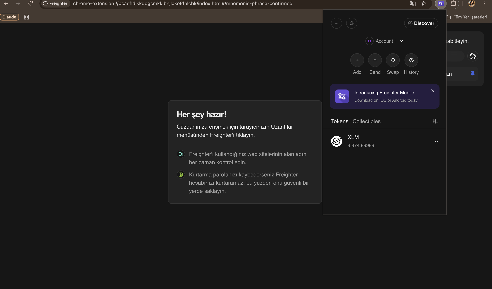

# 🌟 Stellar Payment dApp

A simple payment dApp built on the **Stellar Testnet** for the Rise In "Stellar Journey to Mastery" Level 1 – White Belt challenge.

Connect your Freighter wallet, view your XLM balance, and send XLM to any address on the Stellar testnet.

## ✨ Features

- 🔗 **Wallet Connection** — Connect & disconnect the Freighter wallet
- 💰 **Balance Display** — Fetches and displays the connected wallet's XLM balance (with refresh)
- 💸 **Send XLM** — Build, sign (via Freighter) and submit payment transactions on testnet
- ✅ **Transaction Feedback** — Success/failure state, transaction hash, and a Stellar Expert explorer link
- 🛡️ **Error Handling** — Clear messages for unfunded accounts, rejected signatures, and failed transactions

## 🛠️ Tech Stack

- [React](https://react.dev) + [Vite](https://vitejs.dev)
- [`@stellar/stellar-sdk`](https://www.npmjs.com/package/@stellar/stellar-sdk) — Horizon API & transaction building
- [`@stellar/freighter-api`](https://www.npmjs.com/package/@stellar/freighter-api) — wallet integration
- Stellar **Testnet** (Horizon: `https://horizon-testnet.stellar.org`)

## 🚀 Setup & Run Locally

**Prerequisites:** Node.js 18+, [Freighter wallet](https://www.freighter.app) browser extension set to **Test Net**.

```bash
git clone https://github.com/gulcannce/stellar-payment-dapp.git
cd stellar-payment-dapp
npm install
npm run dev
```

Open `http://localhost:5173` in your browser.

**Getting test XLM:** In Freighter (on Test Net), click **Fund with Friendbot** to receive 10,000 test XLM.

## 📖 How to Use

1. Click **"Freighter Cüzdanını Bağla"** and approve the connection in Freighter
2. Your XLM balance is displayed automatically
3. Enter a destination address (`G...`) and an amount, click **Gönder**
4. Approve the transaction in Freighter
5. See the result: success message with the transaction hash + Stellar Expert link

## 📸 Screenshots

### Wallet Connected, Balance Displayed & Successful Testnet Transaction


### Freighter Wallet (Testnet)


## 🔗 Example Transaction

Hash: `4f9b65d6010975f1b86b12bac37938fd1cac3ea2c725ced9804e5cd20ea1b2c4`
[View on Stellar Expert](https://stellar.expert/explorer/testnet/tx/4f9b65d6010975f1b86b12bac37938fd1cac3ea2c725ced9804e5cd20ea1b2c4)

---

Built with ❤️ on Stellar Testnet
