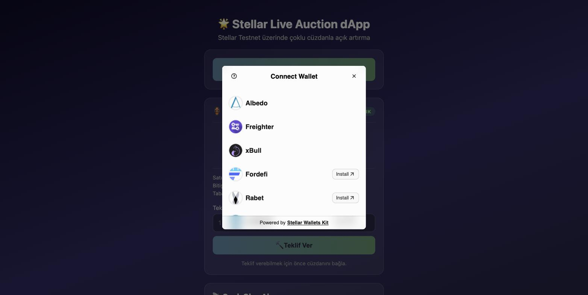
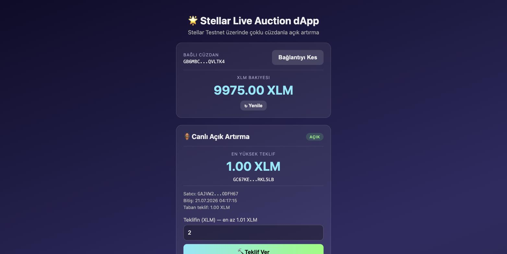
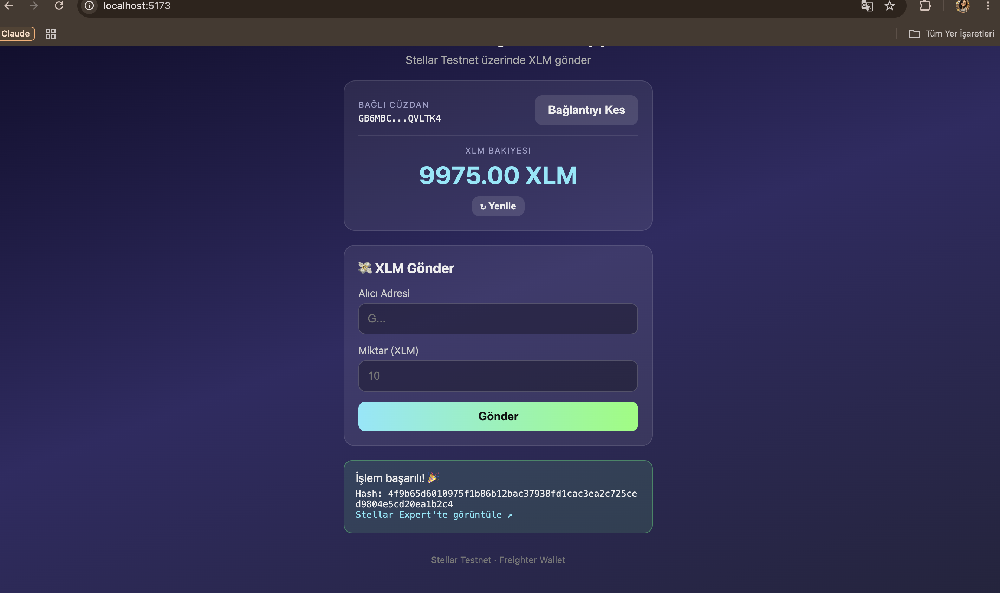
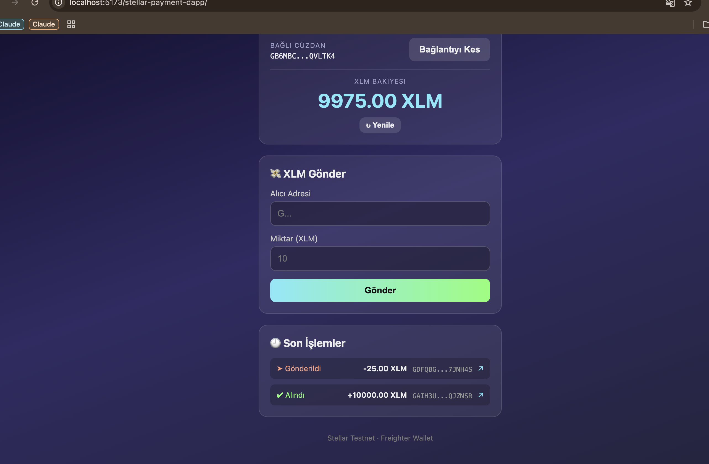

# 🌟 Stellar Live Auction dApp

A Stellar Testnet dApp built for the Rise In "Stellar Journey to Mastery" challenge.

- **Level 1 – White Belt** ✅ *(Approved)* — a payment dApp (Freighter wallet, XLM balance, send XLM, transaction history)
- **Level 2 – Yellow Belt** — evolves the same app into a **live, on-chain auction**: multi-wallet support, a deployed Soroban smart contract, real-time event synchronization, and explicit transaction-status tracking.

🌐 **Live Demo:** https://gulcannce.github.io/stellar-payment-dapp/

## ✨ Features

### Level 2 — Live Auction
- 🔗 **Multi-wallet support** via [StellarWalletsKit](https://github.com/Creit-Tech/Stellar-Wallets-Kit) — Freighter, xBull, Albedo, Rabet, Lobstr, Hana and more, all through one connect flow
- 🏺 **Soroban smart contract** (`contracts/auction`) deployed to testnet: `initialize`, `bid`, `get_state`, `finalize`
- 💰 **On-chain escrow with automatic refunds** — a new highest bid pulls XLM into the contract and refunds the previous highest bidder in the same transaction
- 📡 **Real-time event feed** — polls Soroban RPC `getEvents` (cursor-based) to show new bids and auction finalization live, with no page refresh
- 🧭 **Explicit transaction status machine** — every action moves through `idle → pending → success | fail`, shown in the UI at each step (building, awaiting signature, submitted, confirmed)
- 🛡️ **Three classified error types** — `wallet-not-found`, `rejected`, and `insufficient-balance` (checked client-side *before* submitting), each with its own message
- 🔍 **Read-only contract reads** — auction state loads even before a wallet is connected (simulated call, no signature needed)

### Level 1 — Payment (retained)
- 💰 XLM balance display with refresh
- 💸 Send XLM to any address, signed via the connected wallet
- 🕘 Last 5 transactions with Stellar Expert links

## 🏺 Smart Contract

| | |
|---|---|
| Network | Stellar Testnet |
| Contract | `contracts/auction` (Rust / Soroban SDK 26) |
| Contract ID | [`CCQFEVYW2DXCV4P6YRLJIPWXHV6WWOYKKWRYEYEXLFDZH6IOPCXSMTZV`](https://stellar.expert/explorer/testnet/contract/CCQFEVYW2DXCV4P6YRLJIPWXHV6WWOYKKWRYEYEXLFDZH6IOPCXSMTZV) |
| Payment token | Native XLM (Stellar Asset Contract) `CDLZFC3SYJYDZT7K67VZ75HPJVIEUVNIXF47ZG2FB2RMQQVU2HHGCYSC` |
| Functions | `initialize(seller, token, min_bid, end_time)`, `bid(bidder, amount)`, `get_state()`, `finalize()` |
| Tests | `cargo test -p auction` — covers accepted/rejected bids, automatic refund, finalize payout, double-init/double-finalize guards |

## 🛠️ Tech Stack

- [React](https://react.dev) 19 + [Vite](https://vitejs.dev)
- [`@stellar/stellar-sdk`](https://www.npmjs.com/package/@stellar/stellar-sdk) — Horizon + Soroban RPC, contract invocation, XDR conversion
- [`@creit.tech/stellar-wallets-kit`](https://www.npmjs.com/package/@creit.tech/stellar-wallets-kit) — multi-wallet connect/sign
- [`soroban-sdk`](https://crates.io/crates/soroban-sdk) 26 (Rust) — the auction smart contract
- Stellar **Testnet** (Horizon: `https://horizon-testnet.stellar.org`, RPC: `https://soroban-testnet.stellar.org`)

## 🚀 Setup & Run Locally

**Prerequisites:**
- Node.js 18+
- A Stellar wallet browser extension (Freighter, xBull, Albedo, Rabet, Lobstr or Hana) set to **Test Net**
- To rebuild/redeploy the contract: Rust + `rustup target add wasm32v1-none` + [Stellar CLI](https://developers.stellar.org/docs/tools/cli/stellar-cli) (`brew install stellar-cli`)

```bash
git clone https://github.com/gulcannce/stellar-payment-dapp.git
cd stellar-payment-dapp
npm install
npm run dev
```

Open `http://localhost:5173/stellar-payment-dapp/` in your browser.

**Getting test XLM:** connect your wallet, then fund it with Friendbot (10,000 test XLM).

**Rebuilding/redeploying the contract (optional — a live instance is already deployed):**

```bash
cd contracts/auction && cargo test          # run unit tests
cd ../.. && stellar contract build          # -> target/wasm32v1-none/release/auction.wasm
stellar contract deploy --wasm target/wasm32v1-none/release/auction.wasm \
  --source <your-key> --network testnet --alias auction
stellar contract invoke --id auction --source <your-key> --network testnet \
  -- initialize --seller <G...> --token CDLZFC3SYJYDZT7K67VZ75HPJVIEUVNIXF47ZG2FB2RMQQVU2HHGCYSC \
  --min_bid 10000000 --end_time <unix-timestamp>
```

If you redeploy, update the `CONTRACT_ID` in `src/lib/config.js`.

## 📖 How to Use

**Live Auction (Level 2):**
1. Click **"🔗 Cüzdan Bağla"** and pick a wallet (Freighter, xBull, Albedo, ...)
2. The current highest bid, seller, and end time load automatically — even before connecting
3. Enter a bid above the current highest (or the minimum, if none yet) and click **"🔨 Teklif Ver"**
4. Approve the transaction in your wallet — the status banner tracks *building → awaiting signature → pending → success*
5. Watch the **Canlı Olay Akışı** (live event feed) update with the new bid; if you were outbid, your XLM is refunded automatically

**Payment (Level 1, still available once connected):**
1. Enter a destination address and amount, click **Gönder**
2. Approve in your wallet
3. See the result: success message with the transaction hash + Stellar Expert link

## 🛡️ Error Handling

| Type | When it triggers | Where |
|---|---|---|
| `wallet-not-found` | Selected wallet extension isn't installed/connected | Connect flow |
| `rejected` | User declines the connection or transaction signature | Connect & sign flows |
| `insufficient-balance` | Checked **client-side before submitting** (balance − fee/reserve buffer < amount) | Bid & payment flows |

## 📸 Screenshots

### Multi-wallet selection (StellarWalletsKit)


### Connected wallet, balance, and live auction state


### Level 1 — Wallet Connected, Balance & Successful Transaction


### Level 1 — Transaction History


## 🔗 Example Transactions

- **Contract deploy:** [`f89031fb4053c138311db50991b4b1bbac910868646fda603ad25d258f71ec19`](https://stellar.expert/explorer/testnet/tx/f89031fb4053c138311db50991b4b1bbac910868646fda603ad25d258f71ec19)
- **Contract call (`bid`)**, verifiable on Stellar Explorer: [`c0f8e2713ae9b91bc629d9cc615a42c50d0193868b8233c9e7c13a834340f51e`](https://stellar.expert/explorer/testnet/tx/c0f8e2713ae9b91bc629d9cc615a42c50d0193868b8233c9e7c13a834340f51e)
- **Level 1 payment:** [`4f9b65d6010975f1b86b12bac37938fd1cac3ea2c725ced9804e5cd20ea1b2c4`](https://stellar.expert/explorer/testnet/tx/4f9b65d6010975f1b86b12bac37938fd1cac3ea2c725ced9804e5cd20ea1b2c4)

---

Built with ❤️ on Stellar Testnet
